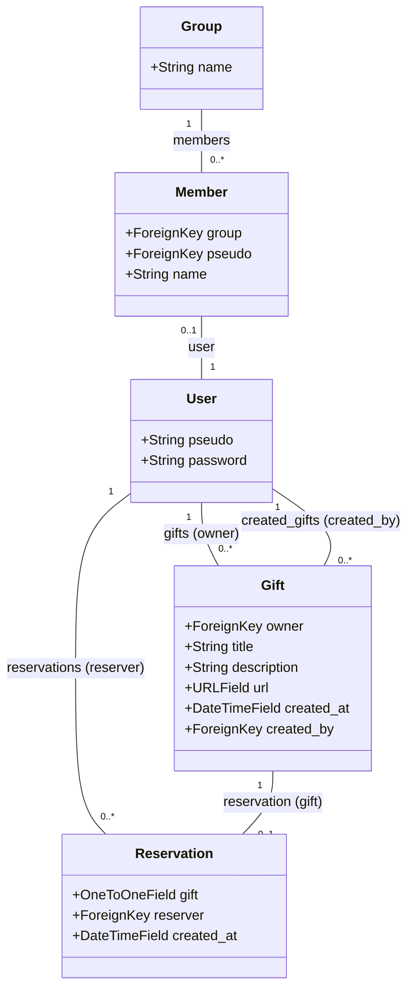

# listenoel

```mermaid
classDiagram
    class Group {
        +String name
    }
    
    class Member {
        +ForeignKey group
        +ForeignKey pseudo
        +String name
    }

    class User {
        +String pseudo
        +String password
    }

    class Gift {
        +ForeignKey owner
        +String title
        +String description
        +URLField url
        +DateTimeField created_at
        +ForeignKey created_by
    }

    class Reservation {
        +OneToOneField gift
        +ForeignKey reserver
        +DateTimeField created_at
    }
    Group "1" -- "0..*" Member : members
    Member "0..1" -- "1" User : user
    User "1" -- "0..*" Gift : gifts (owner)
    User "1" -- "0..*" Gift : created_gifts (created_by)
    User "1" -- "0..*" Reservation : reservations (reserver)
    Gift "1" -- "0..1" Reservation : reservation (gift)
```